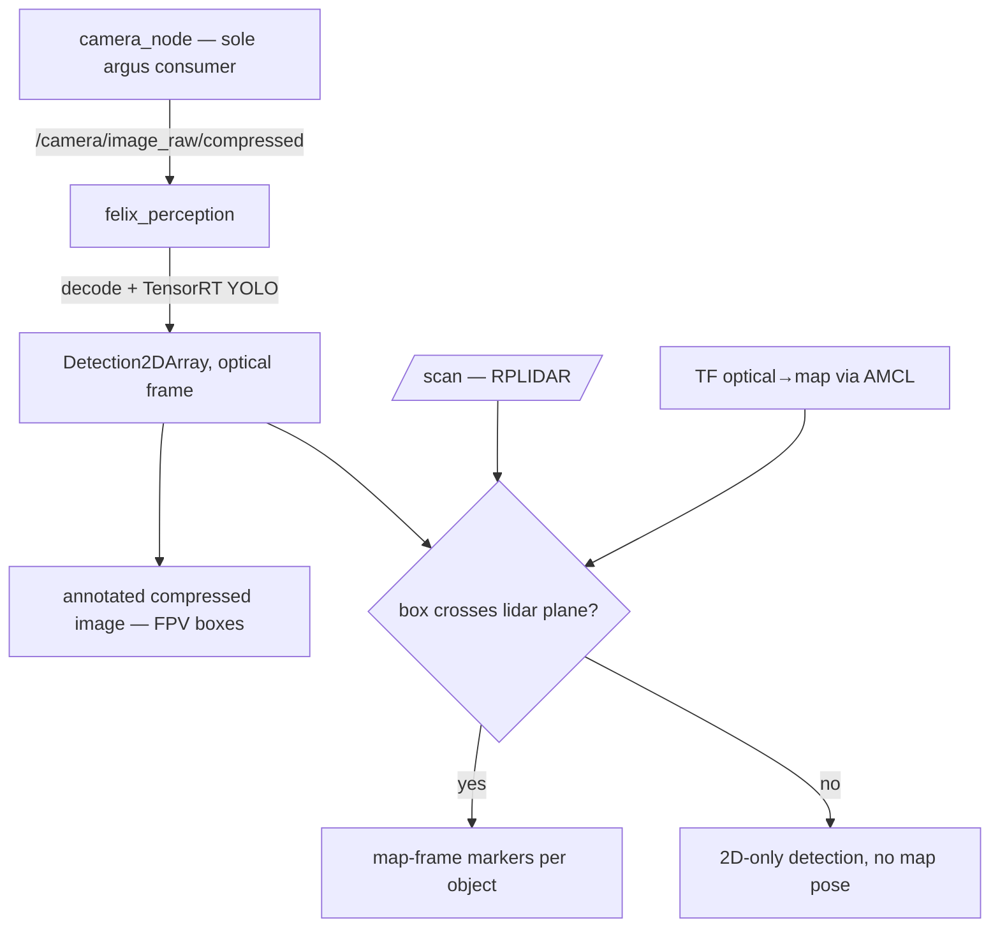

# Felix Perception Foundation — YOLO detection + 3D map placement

## Summary

Stand up a new `felix_perception` ROS 2 package that runs YOLO on Felix's CSI
camera, draws detections on the FPV stream, and projects floor-standing
detections to 3D positions on the AMCL map via the RPLIDAR. This is the
perception spine every later capability (Home Assistant output, fiducial
docking) builds on. Docking is explicitly out of scope.

## Problem Frame

Felix has a working autonomy stack (odometry → EKF → SLAM/AMCL → Nav2) and a
working camera, but **zero perception**: `src/felix_camera/camera_node.py` only
publishes a JPEG stream for human FPV viewing, and there is no `felix_perception`
package, no `camera_info`/calibration, and no REP-105 optical frame in the URDF.
"Give the robot eyes" is the next missing layer, and getting its foundations
(image path, calibration, frame discipline, detection contract) right once is
what makes 3D fusion, smart-home output, and fiducial work cheap later — or
expensive forever if the frame/calibration are wrong.

## Key Decisions

- **Pixel path: subscribe-and-decode, camera_node untouched.** `felix_perception`
  subscribes to the existing `/camera/image_raw/compressed` and decodes the JPEG
  locally. Rejected co-locating YOLO in the camera process (couples perception
  lifecycle to the single-argus sensor owner; can't iterate the model without
  dropping the camera) and adding a raw `Image` publisher to `camera_node`
  (edits the fragile sensor owner; a 960×540 BGR frame across processes is *more*
  copying than a JPEG round-trip under default DDS). The decode cost (~2–6 ms on
  the Orin) is negligible next to inference, and perception is not a control loop
  — 50–100 ms latency is fine. A raw publisher remains a cheap, documented escape
  hatch (see Scope Boundaries) because the perception node already takes *an image
  topic* as input.
- **Inference: TensorRT FP16 engine, consume the camera's frames (no second
  throttle).** Export Ultralytics YOLO to a TensorRT FP16 engine (the 5–10× win
  over PyTorch on Jetson). Perception subscribes depth-1 and always processes the
  *latest* published frame, dropping stale ones — so the effective rate
  self-regulates to `min(camera publish rate, sustainable inference rate)` with no
  separate FPS-cap parameter. Total GPU/thermal load is tuned with the camera's
  existing `max_fps` knob, not a redundant perception-side cap. An explicit
  perception throttle is deferred to the one case that needs it (smooth high-rate
  FPV *and* deliberately slower detection) — see Scope Boundaries.
- **Calibration is in critical path, not optional.** Because the goal includes
  3D map placement, accurate camera intrinsics (`camera_info` K+D from a one-time
  checkerboard calibration) and a correct REP-105 optical frame are prerequisites,
  not polish — pixel→ray back-projection is meaningless without them.
- **3D placement is limited to the lidar plane by design.** The RPLIDAR is a
  single horizontal scan; only detections whose object crosses that plane
  (floor-standing: people, chairs, couches, table legs) get a real range and a
  map pose. Above-plane objects (wall art, countertop items) publish as 2D
  detections with no map pose — an accepted limitation, not a defect.

## Requirements

**Camera input & framing**

- R1. `felix_perception` subscribes to `/camera/image_raw/compressed` and decodes
  to BGR; it never opens the CSI sensor directly (argus allows one consumer, owned
  by `camera_node`).
- R2. A `camera_optical_link` frame (REP-105, z-forward) is added to the
  `felix_description` URDF, fixed relative to the existing `camera_link`, and
  published on `/tf_static`.
- R3. A one-time checkerboard calibration produces a `camera_info` (K + distortion)
  that is published alongside detections and version-controlled in the repo.

**YOLO inference**

- R4. Detections are produced by an Ultralytics YOLO model exported to a TensorRT
  FP16 engine, running on the Jetson GPU.
- R5. Perception subscribes depth-1 and always processes the latest published
  frame, dropping stale frames rather than queueing; it does not impose its own
  FPS cap. Effective detection rate is `min(camera publish rate, sustainable
  inference rate)`, and load is tuned via the camera's existing `max_fps`. The
  960×540 frame is letterboxed to YOLO's 640 input.
- R6. The node publishes `vision_msgs/Detection2DArray`, each detection carrying
  class label, confidence, and 2D bounding box, stamped in the optical frame with
  the source image's timestamp.
- R7. The model uses stock COCO classes for v1; the class set is a parameter so it
  can be narrowed to home-relevant classes without code changes.

**3D grounding**

- R8. A fusion step associates each floor-standing detection's bounding box with
  the RPLIDAR scan to estimate object range, and publishes the object's pose in the
  `map` frame (requires the robot localized — see Dependencies).
- R9. Detections whose object does not intersect the lidar plane are published as
  2D-only (no map pose) and are not dropped or treated as errors.
- R10. 3D object poses are published in a form renderable in Foxglove (e.g. a
  marker per detection at its map position, labeled by class).

**Visualization & success**

- R11. The node publishes an annotated image (boxes + class labels + confidence
  drawn on the frame) on its own compressed topic, leaving the original FPV stream
  untouched.
- R12. The package ships a launch file that starts perception, and composes into a
  `felix_bringup` stack alongside the existing camera/localization launches.

## Key Flow

- F1. Detect → annotate → place on map
  - **Trigger:** Perception stack running with the camera and (for map placement)
    the localization stack up.
  - **Steps:** `camera_node` publishes compressed JPEG → `felix_perception`
    decodes the latest frame → TensorRT YOLO infers at the capped rate →
    `Detection2DArray` published in the optical frame → annotated image republished
    for FPV → fusion associates floor-standing boxes with `/scan`, transforms
    optical → `map` via TF, publishes per-object map markers.
  - **Outcome:** Operator watching Foxglove sees labeled boxes on the video and
    class-labeled markers appear on the map where floor-standing objects are.

## Acceptance Examples

- AE1. Floor-standing object, localized. **Covers R6, R8, R10.** **Given** the
  localization stack is up and a person stands 2 m ahead, **when** perception runs,
  **then** a "person" box is drawn on the FPV image *and* a "person" marker appears
  on the map near the person's true position.
- AE2. Above-plane object. **Covers R9, R11.** **Given** a picture hangs on the
  wall above the scan plane, **when** it is detected, **then** a box is drawn on the
  FPV image but no map marker is published, and no error is raised.
- AE3. Not localized. **Covers R8.** **Given** the robot is not localized (no
  `map` → `odom`), **when** a floor-standing object is detected, **then** the 2D
  detection and FPV box still publish, but map placement is skipped until TF is
  available.

## Scope Boundaries

**Deferred for later (natural next bricks)**

- Custom/home-fine-tuned YOLO model and the record-while-driving dataset flywheel
  (ideation idea #5) — v1 uses stock COCO weights.
- Home Assistant / MQTT publishing of detections and a semantic "planogram"
  (ideation idea #3).
- A raw `Image` publisher on `camera_node` — the documented escape hatch if q80
  JPEG is measured to hurt detection; not built unless evidence demands it.
- A perception-side FPS throttle, separate from the camera's `max_fps` — added only
  if a "smooth high-rate FPV *and* deliberately slower detection" split is ever
  needed; the v1 default is to consume the camera's published frames.

**Outside this effort's identity**

- All fiducial/marker and docking work (the wall AprilTag, strafe visual-servo
  docking, self-describing docks) — parked in
  `docs/ideation/2026-06-16-yolo-perception-ideation.md` Deferred section.
- Any closed-loop control or navigation behavior driven by detections.

## Dependencies / Assumptions

- 3D map placement (R8, R10) assumes the localization stack is running so a
  `map` → `optical_frame` transform exists at detection time; without it, behavior
  degrades to 2D-only per AE3.
- Assumes `ros-humble-vision-msgs`, `cv_bridge`, Ultralytics, and a TensorRT-capable
  PyTorch/ONNX export toolchain are installable on the Jetson image (none are
  current dependencies — verified against `src/felix_camera/package.xml`).
- Assumes the Orin has GPU/thermal headroom to run YOLO continuously alongside the
  autonomy stack; FPS cap (R5) is the primary control.

## Outstanding Questions

**Deferred to planning**

- Confirm the sustainable inference rate by benchmarking a couple of resolutions on
  the real Orin under autonomy-stack load, and set the camera's `max_fps` for
  perception runs accordingly (R5 lets rate self-regulate; this just picks a sane
  camera publish rate).

- Exact bbox↔scan association method (e.g. angular slice of `/scan` under the box
  centroid vs. lidar-point-in-frustum) and how to handle multiple objects sharing a
  scan sector — an implementation choice for `ce-plan`.
- One perception node vs. separate detect / fuse / overlay nodes — packaging detail
  for planning.
- YOLOv8n vs. YOLOv11n specifically, and the engine export workflow on this image.
