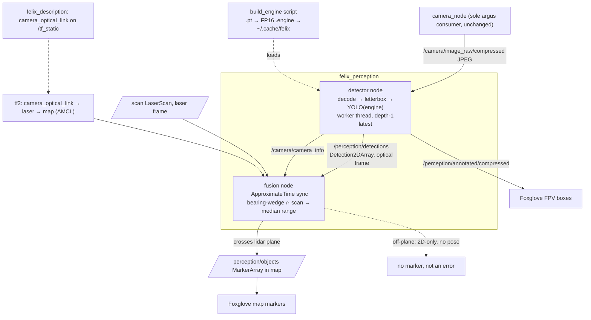

# feat: felix_perception foundation — YOLO detection + 3D map placement

## Summary

Create a new `felix_perception` ament_python package that runs YOLO on Felix's CSI
camera, draws detections on the FPV stream, and projects floor-standing detections to
3D positions on the AMCL map via the RPLIDAR. Two nodes — `detector` (decode → YOLO →
`vision_msgs/Detection2DArray` + annotated image + `CameraInfo`) and `fusion`
(bearing-wedge intersection with `/scan` → `map`-frame markers) — plus a
`camera_optical_link` URDF frame, a committed `camera_info` calibration, and a
`build_engine` setup script. Docking and all fiducial work are deferred.

## Problem Frame

Felix has a working autonomy stack and a working camera, but no perception: `camera_node`
only publishes a JPEG stream for human FPV viewing — there is no `felix_perception`
package, no `camera_info`, and no REP-105 optical frame in the URDF. Getting the
foundations right once (image path, calibration, frame discipline, detection contract)
is what makes later work (Home Assistant output, fiducial docking) cheap. This plan
implements the foundation defined in `origin:`.

---

## Requirements

Carried from `origin:` (R1–R12). Grouped by concern; IDs preserved.

**Camera input & framing**
- R1. `felix_perception` subscribes to `/camera/image_raw/compressed` and decodes to BGR;
  it never opens the CSI sensor directly (argus single-consumer, owned by `camera_node`).
- R2. A `camera_optical_link` frame (REP-105, z-forward) is added to the
  `felix_description` URDF, fixed to `camera_link`, published on `/tf_static`.
- R3. A one-time checkerboard calibration produces a `camera_info` (K + distortion),
  version-controlled in the package and published alongside detections.

**YOLO inference**
- R4. Detections come from an Ultralytics YOLO model exported to a TensorRT FP16 engine,
  running on the Jetson GPU.
- R5. Perception subscribes depth-1 and always processes the latest published frame,
  dropping stale frames rather than queueing; no perception-side FPS cap. Effective rate
  is `min(camera publish rate, sustainable inference rate)`. The perception run pins a
  single camera resolution (matching the calibration; see R13) and letterboxes it to
  YOLO's 640 input.
- R13. The perception launch runs the camera at one pinned resolution that **matches the
  resolution `camera_info` was calibrated at**, and the detector asserts incoming image
  dims equal the `camera_info` dims at startup. (The default `camera.launch.py` emits
  640×360 q60 for FPV while the node *defaults* to 960×540 — intrinsics are
  resolution-specific, so a mismatch silently corrupts every back-projected bearing.)
- R6. The node publishes `vision_msgs/Detection2DArray`, each detection carrying class
  label, confidence, and 2D bbox, stamped in the optical frame with the source image's
  timestamp.
- R7. The model uses stock COCO classes for v1; the class set / weights file is a
  parameter so it can be narrowed without code changes.

**3D grounding**
- R8. The fusion node associates each floor-standing detection's bbox with the RPLIDAR
  scan to estimate range, and publishes the object's pose in the `map` frame (requires
  the robot localized).
- R9. Detections whose object does not intersect the lidar plane are published as 2D-only
  (no map pose) and are not dropped or treated as errors.
- R10. 3D object poses are published in a Foxglove-renderable form (a marker per detection
  at its map position, labeled by class).

**Visualization & packaging**
- R11. The detector publishes an annotated image (boxes + labels + confidence) on its own
  compressed topic, leaving the original FPV stream untouched.
- R12. The package ships a launch file and composes into a `felix_bringup` stack alongside
  the existing camera/localization launches.

---

## Key Technical Decisions

- **Pixel path — subscribe-and-decode, `camera_node` untouched** (see origin: Key
  Decisions). Decode the existing JPEG with `cv2.imdecode`; do not co-locate YOLO in the
  camera process or add a raw publisher. Local decode is ~2–6 ms vs ~15–40 ms inference.
- **Engine built by a setup script, not at first run.** A TensorRT engine is serialized
  against the exact GPU + TRT + CUDA tuple and is not portable. Commit the small `.pt`;
  build the FP16 `.engine` on-device via a `build_engine` console script (mirrors
  `felix_base`'s `calibrate` setup-task idiom) into a writable cache (`~/.cache/felix/`),
  gitignored. The detector loads the cached engine; **if absent it falls back to the `.pt`
  with a warning** (slower torch path, never bricked) and instructs the operator to run
  the script. Re-running the script handles rebuilds after a JetPack/TRT upgrade.
  FP16 only — INT8 is broken on TRT 10.x with Ultralytics and adds a per-device
  calibration burden.
- **The fallback must be observable, not just logged.** A log line is not "loud" in a
  multi-node stack — a `.pt` fallback silently collapses inference rate (engine ~2.4 ms →
  torch path) while everything still publishes, so the operator sees a working-but-sluggish
  system. The detector publishes the active backend (`engine` vs `pt`) and measured
  inference latency on a latched status/diagnostic topic, and exposes a `require_engine`
  param that fails fast in stacks where slow degradation is unacceptable.
- **Warm up before subscribing.** First inference includes engine load + CUDA warmup
  (1–3 s). Run one dummy inference in startup before the first real frame to avoid a
  multi-second stall on frame one.
- **`camera_optical_link` is REP-105** (`rpy="${-pi/2} 0 ${-pi/2}"` relative to
  `camera_link`). Both `CameraInfo` and `Detection2DArray` are stamped in this frame;
  the existing `camera_link` (x-forward) is geometrically wrong for back-projection.
- **vision_msgs 4.1.1 contract.** `ObjectHypothesis.class_id` is a **string** (store
  `model.names[c]`); `bbox.center` is `vision_msgs/Pose2D` with a nested
  `vision_msgs/Point2D` (not `geometry_msgs`). Center in pixels, `size_x/size_y` in pixels.
- **QoS + threading.** Subscribe with sensor-data QoS, depth 1, KEEP_LAST so a frame
  arriving mid-inference replaces the queued one. The camera publishes a reliable depth-10
  publisher; a BEST_EFFORT (sensor-data) subscriber **is** compatible with a RELIABLE
  publisher (request ≤ offered), so frames flow — no publisher change needed. Guard with a
  **time-bounded health check** (warn-then-degrade if no frame within N seconds), not a hard
  startup assert that races the camera's first publish. Run inference on a worker thread
  (mirrors `camera_node`'s loop) so it never blocks the executor (tf, laser, timers).
- **Fusion is the bearing-wedge method, not 3D-cloud projection.** The l2d/l2i references
  assume a 3D point cloud; Felix has a 2D `LaserScan`. Per detection: back-project the
  bbox left/right columns to bearings using K+D (undistort first — CSI edges distort),
  transform the wedge `camera_optical_link → laser` via tf2, take in-wedge returns,
  cluster by range-gap and take the nearest substantial cluster's **median** (mean is
  corrupted by background seen beside the object), then transform to `map` using the image
  timestamp. The camera↔lidar extrinsic comes from the URDF mounts — but the `laser` mount
  block still carries a "TODO: MEASURE" and the stamp is publish-time (see Risks), so U6
  carries an explicit accuracy gate rather than assuming the extrinsic is good.
- **Calibration capture via `compressed_image_transport`.** `cameracalibrator` needs a
  raw `Image`; rather than touch `camera_node`, install `compressed_image_transport` so
  the calibrator subscribes to the existing compressed topic. One-time, offline.
- **Model default `yolo11n` FP16** (newer/faster than v8n: ~2.4 ms vs ~4.1 ms inference);
  weights file is a parameter.
- **Test posture: pytest for pure logic only.** Establish the repo's first pytest suite,
  scoped to hardware-independent code (message construction, bearing back-projection,
  wedge clustering/median, empty-wedge handling). Hardware/ROS-integration behavior
  (camera, YOLO, TF, QoS) is verified manually via launch + Foxglove, matching the repo's
  existing `py_compile` + `colcon build` smoke-check convention. Caveat (surfaced in review):
  the load-bearing failure modes — stamp/time-sync drift, extrinsic yaw error, QoS delivery,
  engine-vs-fallback — all live in the *untested* integration layer. Mitigate with the U6
  rosbag-replay smoke test and a documented manual checklist that explicitly exercises the
  **moving-robot, off-plane, and unlocalized** cases, not just the static person.

---

## High-Level Technical Design



## Output Structure

```
src/felix_perception/
├── package.xml
├── setup.py
├── setup.cfg
├── resource/felix_perception
├── felix_perception/
│   ├── __init__.py
│   ├── detector_node.py
│   ├── fusion_node.py
│   ├── build_engine.py
│   └── geometry.py          # pure-logic: back-projection, wedge clustering, msg builders
├── models/
│   └── yolo11n.pt           # committed; .engine is gitignored, built on-device
├── config/
│   └── camera_info.yaml     # committed calibration output
├── launch/
│   └── perception.launch.py
└── test/
    ├── test_detection_msg.py
    ├── test_backprojection.py
    └── test_wedge_fusion.py
```

---

## Implementation Units

### U1. Scaffold `felix_perception` package and dependencies

**Goal:** A buildable, installable ament_python package mirroring `felix_camera`, shipping
the `.pt` model and a launch skeleton, with new deps declared.
**Requirements:** R1, R7, R12
**Dependencies:** none
**Files:** `src/felix_perception/package.xml`, `setup.py`, `setup.cfg`, `pytest.ini` (or
`[tool:pytest]` in `setup.cfg`), `resource/felix_perception`, `felix_perception/__init__.py`,
`models/yolo11n.pt`, `launch/perception.launch.py` (skeleton), `.gitignore` (add `*.engine`),
`docker/Dockerfile` (add the two genuinely-missing apt packages), `BUILD_NOTES.md` (note the
setuptools<80 interaction).
**Approach:** Copy `felix_camera`'s `setup.py`/`setup.cfg`/`package.xml`/resource marker;
rename. `data_files` ships `launch/*.launch.py`, `models/*.pt`, `config/*.yaml` to the
share dir. `console_scripts`: `detector`, `fusion`, `build-engine` (the node mains; the
launch file in U7 is the primary path for `detector`/`fusion`). `package.xml` `exec_depend`:
`rclpy`, `sensor_msgs`, `vision_msgs`, `cv_bridge`, `message_filters`, `tf2_ros`,
`tf2_geometry_msgs`, `geometry_msgs`, `visualization_msgs`. **Do NOT add `image_geometry` or
`laser_geometry`** — the fusion math uses `cv2.undistortPoints` and raw `LaserScan` arrays,
needs neither, and `image_geometry` isn't even in the image. Comment
`ultralytics`/`torch`/`tensorrt` as image-pip-provided (mirror the existing OpenCV comment),
NOT rosdep. Keep `install_requires=['setuptools']`. Establish the repo's first pytest config
here so later units don't each rediscover the setup. **Dependency reality (verified
on-device):** the base image already provides `ultralytics`/`torch`/`tensorrt`, and the
Dockerfile already installs `ros-humble-cv-bridge`/`vision-msgs`/`image-transport`. The
*only* genuinely new installs are `ros-humble-compressed-image-transport` and
`ros-humble-camera-calibration` (both apt, offline/one-time for calibration) — add them in
the apt tier so they don't touch `setuptools`; no pip add is needed.
**Patterns to follow:** `src/felix_camera/setup.py` (data_files + console_scripts),
`src/felix_base/setup.py` (config glob), `felix_camera/package.xml` (pip-dep comment).
**Test scenarios:** `Test expectation: none — scaffolding`. Verify `colcon build
--symlink-install` succeeds and `ros2 pkg executables felix_perception` lists the three
scripts.
**Verification:** Package builds; executables resolve; model file present in the share dir
via `get_package_share_directory`.

### U2. Add `camera_optical_link` to the URDF

**Goal:** Publish a REP-105 optical frame fixed to `camera_link` on `/tf_static`.
**Requirements:** R2
**Dependencies:** none
**Files:** `src/felix_description/urdf/felix.urdf.xacro`
**Approach:** Add a `<link name="camera_optical_link"/>` and a fixed
`<joint>` parented to `camera_link` with `origin rpy="${-pi/2} 0 ${-pi/2}" xyz="0 0 0"`.
Update the TF-tree header comment and replace the line-67 "gets added when felix_perception
lands" placeholder. No launch change — `robot_state_publisher` auto-emits the static
joint.
**Patterns to follow:** the existing `camera_link` and `laser` link/joint blocks in the
same file; xacro `${pi}` is already in use.
**Test scenarios:** `Test expectation: none — static TF/config`. Manual: with description
running, `ros2 run tf2_ros tf2_echo camera_link camera_optical_link` returns the optical
rotation; `tf2_echo map camera_optical_link` resolves when localized.
**Verification:** Frame present on `/tf_static`; optical rotation correct (z forward,
x right, y down relative to `camera_link`).

### U3. Camera calibration and `CameraInfo`

**Goal:** A committed `camera_info.yaml` and a path for the detector to publish matching
`CameraInfo`.
**Requirements:** R3
**Dependencies:** U1, U2
**Files:** `src/felix_perception/config/camera_info.yaml`,
`src/felix_perception/felix_perception/geometry.py` (a `load_camera_info(yaml_path,
optical_frame) -> CameraInfo` helper), `src/felix_perception/test/test_detection_msg.py`
(shared module).
**Approach:** Calibrate **at the pinned perception resolution (R13)** — capturing at one
resolution and running the detector at another biases K/D. Run `cameracalibrator` (8×6
interior corners, 0.025 m squares) against the compressed topic via
`compressed_image_transport` (`image_transport:=compressed`). Accept the calibration only if
RMS reprojection error is low and board coverage spans the full frame; a mediocre calibration
silently caps fusion accuracy forever. Note the q80-JPEG corner-degradation risk — if RMS is
poor, pull the documented raw-`Image` escape hatch for the calibration session specifically.
Save writes a `camera_info`-style YAML → commit it to `config/` (commit a clearly-marked
placeholder until the hardware calibration is run, so U5/U6 can build). `load_camera_info`
parses K/D/size into a `sensor_msgs/CameraInfo` stamped with the optical frame; the detector
(U5) publishes it on `/camera/camera_info` with each frame's stamp. Document the capture
command in the package README or launch docstring.
**Patterns to follow:** `felix_base` config-in-share-dir loading; `camera_info_manager`
YAML shape.
**Test scenarios (pytest — `test/test_detection_msg.py` shares the module):**
- Happy path: `load_camera_info` on a known YAML returns a `CameraInfo` with K[0,0]==fx,
  correct width/height, and the optical `frame_id`.
- Edge: missing/empty distortion coefficients → zero-length or zeros D handled, not a crash.
**Verification:** `camera_info.yaml` committed; `load_camera_info` round-trips the known
fixture; `ros2 topic echo /camera/camera_info` shows K/D once the detector runs.

### U4. `build_engine` setup script

**Goal:** A one-shot on-device script that exports the committed `.pt` to an FP16 TensorRT
engine in a writable cache.
**Requirements:** R4
**Dependencies:** U1
**Files:** `src/felix_perception/felix_perception/build_engine.py`
**Approach:** Resolve the `.pt` from the package share dir; `YOLO(pt).export(format="engine",
half=True, imgsz=640, batch=1, device=0)`; move/write the result to
`~/.cache/felix/<stem>.engine` (configurable via `--out` / `FELIX_ENGINE_DIR`). Support
`--weights` and `--force` (rebuild after a TRT upgrade). Log the resolved TRT/JetPack
versions and the output path. Console script `build-engine`.
**Patterns to follow:** `felix_base`'s `calibrate` console-script setup-task shape; argparse
entry with a `main()`.
**Test scenarios:** `Test expectation: none — device/GPU-dependent export`. Pure-logic path
resolution (cache dir selection from env/flag default) may get one unit test if extracted to
`geometry.py`. Manual: `ros2 run felix_perception build-engine` produces a loadable
`.engine`; `--force` rebuilds.
**Verification:** Engine file appears in the cache dir; a subsequent `YOLO(engine)` loads
without a deserialize error on-device.

### U5. `detector` node

**Goal:** Decode frames, run YOLO on a worker thread, publish detections + annotated image
+ CameraInfo in the optical frame.
**Requirements:** R1, R4, R5, R6, R7, R11, R13
**Dependencies:** U1, U2, U3; U4 advisory (runs faster with the engine; falls back to the
committed `.pt` if absent, so U5 can be built and integration-tested before U4 lands)
**Files:** `src/felix_perception/felix_perception/detector_node.py`,
`src/felix_perception/felix_perception/geometry.py` (msg builders),
`src/felix_perception/test/test_detection_msg.py`
**Approach:** Subscribe `/camera/image_raw/compressed` with sensor-data QoS depth-1; a
time-bounded health check warns-then-degrades if no frame arrives within N seconds (not a
racy hard assert). On the first frame, assert image dims equal the `camera_info` dims (R13)
and fail loudly on mismatch. Image callback stores `(stamp, frame)` under a lock and returns.
Worker thread: load engine from cache (else `.pt` + warning; honor `require_engine`), warm up
once, then loop on the latest frame — `cv2.imdecode` → `model(bgr, imgsz=640, verbose=False)`
→ build `Detection2DArray` (string `class_id`, `vision_msgs/Pose2D` center in pixels, optical
`frame_id`, source stamp on array and each `Detection2D`) → publish `/perception/detections`.
Publish `CameraInfo` (U3) with the same stamp/frame, and publish the active backend
(`engine`/`pt`) + measured inference latency on a latched `/perception/status` topic. When
`publish_annotated` param is on, draw via `res.plot()`, `cv2.imencode`, publish
`/perception/annotated/compressed`. Params: `weights`, `engine_dir`, `conf`, `imgsz`,
`publish_annotated`, `require_engine`.
**Patterns to follow:** `camera_node`'s worker-thread + lock + latest-frame loop and
`cv2.imencode` publish; `camera.launch.py` arg-dict pattern.
**Execution note:** Build the `geometry.py` message-builder test-first — it pins the exact
vision_msgs 4.1.1 shape that downstream and Foxglove depend on.
**Test scenarios (pytest — `test/test_detection_msg.py`):**
- Covers R6. Happy path: builder turns a `(xyxy, conf, cls, names)` tuple into a
  `Detection2D` with `results[0].hypothesis.class_id == "person"` (string), `score` set,
  `bbox.center.position.x == (x1+x2)/2`, `size_x == x2-x1`, header `frame_id` == optical.
- Edge: empty detections → `Detection2DArray` with `detections == []`, header still stamped.
- Edge: `class_id` is always a `str` even when names lookup falls back to the integer.
- Contract: `bbox.center` is `vision_msgs/Pose2D`/`Point2D` (guards the geometry_msgs
  mix-up).
**Verification:** `ros2 topic echo /perception/detections` shows correctly-typed messages in
the optical frame; annotated stream renders boxes in Foxglove; second-frame latency ≪
first-frame (warmup worked).

### U6. `fusion` node — bearing-wedge 3D placement

**Goal:** Place floor-standing detections on the `map` via the RPLIDAR; pass through
off-plane detections as 2D-only.
**Requirements:** R8, R9, R10
**Dependencies:** U2, U3, U5
**Files:** `src/felix_perception/felix_perception/fusion_node.py`,
`src/felix_perception/felix_perception/geometry.py` (back-projection + wedge math),
`src/felix_perception/test/test_backprojection.py`,
`src/felix_perception/test/test_wedge_fusion.py`
**Approach:** `message_filters.ApproximateTimeSynchronizer` over `/perception/detections`
and `/scan` (slop ~30–50 ms). Per detection: undistort bbox left/right x with K/D
(`cv2.undistortPoints`) → bearings `[θ_L, θ_R]` in the optical frame; transform the wedge to
the `laser` frame via tf2; keep scan returns whose bearing is in-wedge; range-gap cluster and
take the nearest substantial cluster's median range; build the point at `(median, mid-bearing)`
in `laser`, transform to `map` using the image stamp; publish a labeled `Marker` per object on
`/perception/objects`. Empty wedge or too-few-returns → emit no marker (2D-only), no error.
No `map→odom` (not localized) → skip placement, log once.
**Patterns to follow:** the research's bearing-wedge algorithm; tf2 buffered lookups; marker
labeling by class.
**Test scenarios (pytest — pure geometry, no ROS spin):**
- Covers R8. Back-projection: a pixel at `cx` → bearing ≈ 0; symmetric pixels → symmetric
  bearings; known fx/cx maps a known column to the expected angle (within tolerance).
- Covers R8. Wedge selection: given a synthetic scan (ranges at known angles) and a bearing
  wedge, returns only in-wedge indices.
- Range clustering: a wedge with a near object (cluster ~1 m) plus background returns (~4 m)
  → median resolves to the near cluster, not the mean.
- Covers R9. Empty wedge (no returns in-wedge) → returns "no range" sentinel; caller emits no
  marker and does not raise.
- Edge: single in-wedge return (too-few) handled (widen or mark unavailable) without crash.
- Edge: two objects in overlapping wedges → each assigned to the nearest-center-bearing
  cluster.
**Verification:** Define an extrinsic-accuracy gate before U6 is "done": with a person at a
**known** range/bearing and localization up, the `map` marker lands within a stated budget
(e.g. ≤ X cm at 2 m). If the URDF-derived extrinsic misses it, the remediation is to measure
`camera_optical_link → laser` (the `laser` mount is still "TODO: MEASURE"), not to tune the
algorithm. Verify **while the robot rotates**, not only stationary — that exposes the
publish-time-stamp error (see Risks). Then: wall picture above the plane → box but no marker
(AE2); a thin-legged chair → measured, not assumed (AE4); unlocalized → detections but no
markers (AE3). Add a small replayable rosbag fixture (`/camera` + `/scan` + `/tf`) the
fusion node runs against to assert a marker lands within tolerance without a full robot.

### U7. Compose into `felix_bringup`

**Goal:** A `perception` toggle that launches detector + fusion alongside camera +
localization.
**Requirements:** R12
**Dependencies:** U5, U6
**Files:** `src/felix_perception/launch/perception.launch.py`,
`src/felix_bringup/launch/localization.launch.py`,
`src/felix_bringup/launch/navigation.launch.py`, `src/felix_bringup/package.xml`
**Approach:** `perception.launch.py` starts both nodes from an `args`-dict (params: `weights`,
`conf`, `publish_annotated`, `engine_dir`). In bringup, add a `perception` boolean
`DeclareLaunchArgument` and an `_inc("felix_perception", ["launch", "perception.launch.py"],
condition=IfCondition(perception))` to `localization.launch.py` (rides with camera+AMCL,
which fusion needs) and `navigation.launch.py`. Add `<exec_depend>felix_perception</exec_depend>`
to `felix_bringup/package.xml`.
**Patterns to follow:** the `_inc(...)` helper and `camera` toggle already in
`localization.launch.py`; `felix_camera/launch/camera.launch.py` arg-dict.
**Test scenarios:** `Test expectation: none — launch composition`. Manual:
`ros2 launch felix_bringup localization.launch.py perception:=true` brings up both nodes;
`perception:=false` omits them.
**Verification:** Toggle works in both stacks; with `perception:=true` and a localized robot,
boxes render on FPV and markers appear on the map.

---

## Acceptance Examples

Carried from `origin:`.
- AE1. Floor-standing object, localized. **Covers R6, R8, R10.** Given localization up and a
  person 2 m ahead, the detector draws a "person" box on the FPV image and the fusion node
  publishes a "person" marker near the person's true map position.
- AE2. Above-plane object. **Covers R9, R11.** Given a wall picture above the scan plane, a box
  is drawn but no map marker is published and no error is raised.
- AE3. Not localized. **Covers R8.** Given no `map → odom`, 2D detections and FPV boxes still
  publish; map placement is skipped until TF is available.
- AE4. Thin floor-standing object. **Covers R8, R9.** The RPLIDAR plane sits ~0.115 m above
  the floor, so reliable map placement is only for objects that cross it. Given a chair
  (thin legs at beam height), a marker is placed if returns are found, else it degrades to
  2D-only like AE2 — measured on hardware, not assumed. Sets the expectation that v1's "3D
  placement" is robust for people and reliable only for objects intersecting the beam.

---

## Scope Boundaries

**Deferred to follow-up work**
- Home Assistant / MQTT publishing of detections and the semantic "planogram" (ideation #3).
- Record-while-driving dataset capture and home-fine-tuned weights (ideation #5); v1 ships
  stock COCO.
- A raw `Image` publisher on `camera_node` — the documented escape hatch only if q80 JPEG is
  measured to hurt detection.
- A perception-side FPS throttle separate from the camera's `max_fps`.

**Outside this effort's identity**
- All fiducial/marker and docking work (parked in
  `docs/ideation/2026-06-16-yolo-perception-ideation.md`).
- Any closed-loop control or navigation behavior driven by detections.

---

## Risks & Dependencies

- **Dependency reality (review correction).** `ultralytics`/`torch`/`tensorrt` come from the
  base image; `cv_bridge`/`vision_msgs`/`image_transport` are already installed. The only new
  installs are `ros-humble-compressed-image-transport` and `ros-humble-camera-calibration`
  (apt). Residual risk: any *pip* install added later bumping `setuptools` past 80 breaks
  `--symlink-install` — keep new installs in the apt tier and re-assert the `<80` pin after
  any pip step.
- **Resolution/calibration mismatch (P1).** The bringup-composed `camera.launch.py` defaults
  to 640×360 while the node defaults to 960×540; intrinsics are resolution-specific. The
  perception launch must pin one resolution matching the calibration, asserted at startup
  (R13) — otherwise every back-projected bearing is silently wrong.
- **Image stamp is publish-time, not capture-time.** `camera_node` stamps at encode/publish
  (`camera_node.py` sets `header.stamp = now()` after capture + throttle). The fusion TF
  lookup and `ApproximateTimeSynchronizer` use that stamp, so on a **rotating** robot the
  wedge is dragged off the true object — a silent accuracy floor on AE1. Verify while
  rotating; consider gating placement to low-angular-velocity moments, or moving the stamp to
  capture time in `camera_node` as a noted (cross-package) prerequisite.
- **Camera↔lidar extrinsic is from unmeasured mounts.** The `laser` URDF block carries
  "TODO: MEASURE"; a few degrees of yaw throws the wedge off at range. U6 carries an explicit
  accuracy gate + remediation (measure the extrinsic) rather than assuming it is good.
- **QoS** — a BEST_EFFORT subscriber is compatible with the reliable publisher (frames flow);
  guard with a time-bounded health check, not a racy startup assert.
- **Engine non-portability** after a JetPack/TRT upgrade: a stale cached `.engine` fails to
  deserialize. Mitigated by `.pt` fallback + `build-engine --force`; the fallback is made
  observable via `/perception/status` so the perf cliff isn't silent.
- **vision_msgs 4.1.1 shape** (string `class_id`, `vision_msgs/Pose2D` bbox) differs from
  older examples; pinned by the U5 contract test.
- **Sustainable end-to-end FPS** (decode + letterbox + NMS + annotate under concurrent
  autonomy-stack GPU/thermal load) is still unbenchmarked — confirm on hardware (deferred).

---

## Sources & Research

- Origin requirements: `docs/brainstorms/2026-06-16-felix-perception-foundation-requirements.md`;
  ideation context: `docs/ideation/2026-06-16-yolo-perception-ideation.md`.
- Patterns to mirror: `src/felix_camera/` (package layout, worker-thread capture loop, launch
  arg-dict), `src/felix_base/setup.py` (config glob) and `calibrate` console-script idiom,
  `src/felix_description/urdf/felix.urdf.xacro` (link/joint blocks; line-67 optical-frame TODO),
  `src/felix_bringup/launch/localization.launch.py` (`_inc` + toggle).
- On-device toolchain (verified): JetPack 6.2 / L4T R36.4.4, TensorRT 10.7, CUDA 12.6,
  `ultralytics` 8.4.61, `torch` 2.10 (CUDA), `vision_msgs` 4.1.1; `camera_calibration` and
  `compressed_image_transport` not yet installed.
- Ultralytics TensorRT export & predict docs; Jetson guide; TRT10 INT8/end2end issue
  (ultralytics#19302). Fusion adapts the bearing-wedge approach (l2d/l2i assume a 3D cloud;
  RPLIDAR is a 2D `LaserScan`).
- Confirmed topics/frames: `/scan` frame `laser` (`src/felix_slam/launch/rplidar.launch.py`),
  AMCL `map→odom` (`src/felix_slam/config/amcl.yaml`), camera publishes relative
  `camera/image_raw/compressed` at 960×540, `frame_id` `camera_link`.
